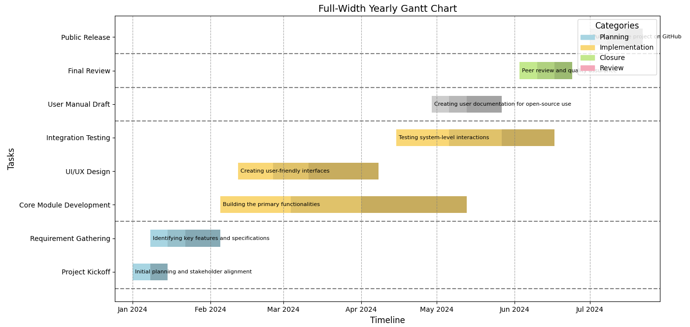

# Ganttly

An interactive and customizable Gantt chart generator for visualizing project timelines. This tool is ideal for project managers, developers, and researchers to organize and track tasks with ease.

## Features

- **Dynamic Task Management**: Add tasks with descriptions, categories, and durations.
- **Customizable Colors**: Define category-specific colors with progressive shading for clear visualization.
- **Multi-category Support**: Handles multiple task categories with unique visual distinctions.
- **Weekly Breakdown**: Displays task progress in weekly intervals.
- **Open-Source**: Free to use, modify, and share.

## Example Chart



## Installation

1. Clone the repository:
   ```bash
   git clone https://github.com/bjnhur/ganttly.git
   ```
2. Install the required Python packages:
   ```bash
   pip install -r requirements.txt
   ```

## Usage

1. Add your tasks to the `data` list in the script:
   ```python
   data = [
       {"Category": "Planning", "Task": "Project Kickoff", "Description": "Initial planning and stakeholder alignment", "Start": "2024-01", "End": "2024-03"},
       {"Category": "Implementation", "Task": "Core Module Development", "Description": "Building the primary functionalities", "Start": "2024-06", "End": "2024-20"},
       ...
   ]
   ```
2. Run the script:
   ```bash
   python gantt.py
   ```
3. The Gantt chart will be displayed and can be saved as an image.

## Contribution

Contributions are welcome! Please fork the repository and create a pull request with your improvements.

## License

This project is licensed under the [MIT License](LICENSE).

## Author

Created by [Bongjun Hur](https://github.com/bjnhur).
